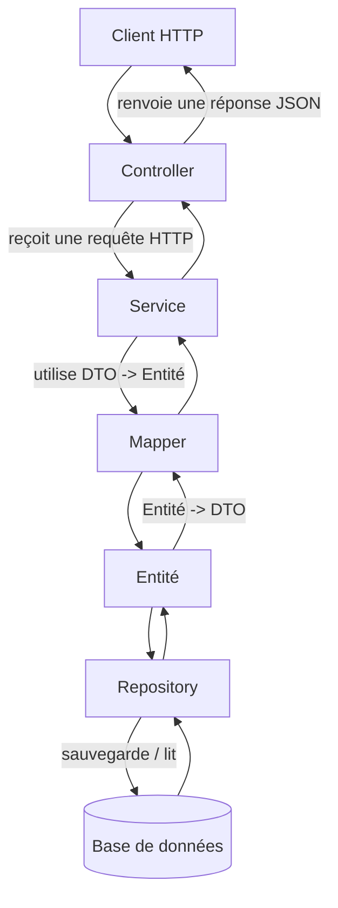

```mermaid
graph TD
    Client[Client HTTP] --> Controller[Controller]
    Controller -->|reçoit une requête HTTP| Service[Service]
    Service -->|utilise DTO -> Entité| Mapper[Mapper]
    Mapper --> Entity[Entité]
    Entity --> Repo[Repository]
    Repo -->|sauvegarde / lit| DB[(Base de données)]
    DB --> Repo
    Repo --> Entity
    Entity -->|Entité -> DTO| Mapper
    Mapper --> Service
    Service --> Controller
    Controller -->|renvoie une réponse JSON| Client
```